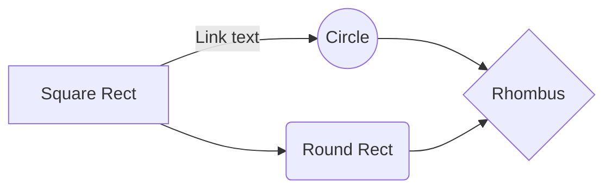

## This is my first blog post

 ```tsql
 SELECT *
 FROM sys.tables
 WHERE [name] = 'SomeTable'
 ```


And this will produce a flow chart:


```mermaid
graph LR
A[Square Rect] -- Link text --> B((Circle))
A --> C(Round Rect)
B --> D{Rhombus}
C --> D
```
